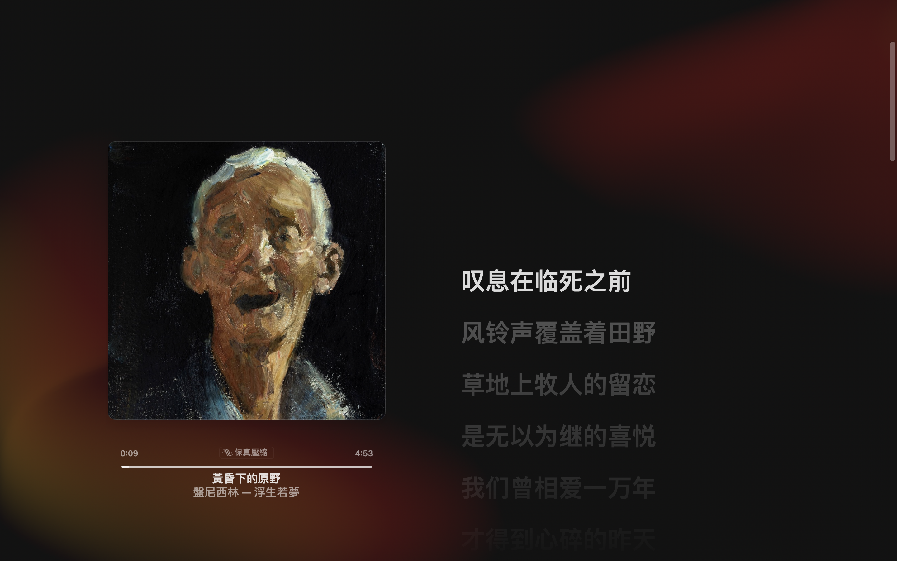
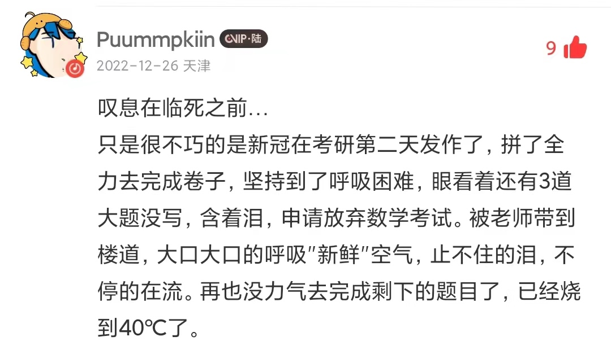

> 叹息在临死之前，风铃声覆盖着田野，草地上牧人的留恋，是无以为继的喜悦

这句歌词出自于**盘尼西林**乐队的一首「黄昏下的原野 The Field under Sunset」。

>Please don't leave me alone

>Just wanna die in peace with you

>Please don't leave me alone

>Just wanna die in peace with you

>Please don't leave me alone

在最后的瞬间
请站在我的身边 亲吻我的一切