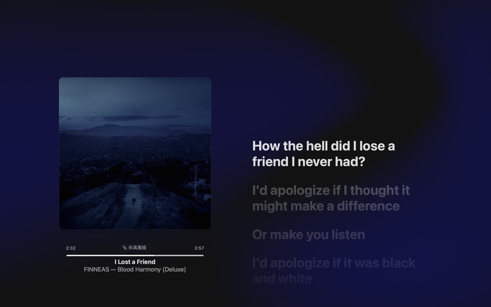

> 叹息在临死之前，风铃声覆盖着田野，草地上牧人的留恋，是无以为继的喜悦。  
> -「黄昏下的原野」盘尼西林

---

## 圣诞节

2022年的圣诞节🎄失去了往日的喜悦🎆，失去了炽热的爱恋❤️，失去决定未来的考试...
是的，不幸💔2022年12月25日患上新冠病毒。

一时间内失去了所有的记忆💫。

甚至记不起自己是谁😞。

### I lost a friend

25日的圣诞节🎄同时也是**Postgraduate Entrance Examination**的第二天。  
明明是一份很开心的节日，可是却让我失去了她。「Astrophysics M.D入学资格」

### Christmas Eve

时间 03:14  
凌晨中突然惊醒，浑身发冷。  
感觉就好像冰冷冷的泡在充满冰块🧊浴缸🛁里。  
清醒后的第一个念头就是「have a fever」🤒了。

随身携带的电子体温计，逃不了的是红色警告⚠️界面「38.8°C」

强忍着一个念头：
>不要害怕！就是一个发烧嘛，不可能是感染新冠病毒的！  
考完今天最重要的两科再倒下！💪🏻

摸着黑，翻出行李箱中随身携带的「急救包」。  
喝完两包退烧药，渐渐失去「意识」再次进入睡眠😴。  
时间 03:33

只是...  
很不巧的是新冠却在在考研第二天上午发作了。 

拼了全力去完成卷子，坚持到了呼吸困难，眼看着还有3道大题没写，含着泪，申请放弃数学考试。被老师带到楼道，大口大口的呼吸"新鲜"空气，止不住的泪，不停的在流。再也没力气去完成剩下的题目了，已经烧到40°C了。

不经意间抬头望向窗外，天空依旧很蓝，很蓝，晴朗的看不见一朵云。冰凉的楼道风吹着口罩憋红的脸颊，那些说不出口的的泪顺着眼角溢出来。巡考的老师也吓坏了，陪着我身边，不时的给我端红糖水。泪水渐渐停下来了，忍不住的头疼止住了逝去的愿望带来的泪水。

## 叹息在临死之前

I'd apologise if it was black and white  
我的道歉 这可以只是或黑或白  
But life is different  
但生活不是  
Just try to listen to me now  
只需此刻试着聆听我的言语  
I know I'll be alright but I'm not tonight  
我知道我会没事 但不是今晚  
I lost a friend I lost a friend  
我失去了朋友 我失去了一个朋友  
I lost my mind and nobody believes me  
我丧失了理智  
Say I know that he don't need me  
说：“我知道他不需要我”  
'Cause he made a little too much money to be 20 and sad  
因为他已年过20 可以自力更生 也可以自己承担苦闷  
And I'll be fine without 'em  
我没有他们也可以过得很好  
But all I do is write about 'em  
但我做的一切却是写下关于他们的事  
How the hell did I lose a friend I never had  
该死 嘴里说着失去了朋友却其实从未有过  
Never had  
从未有过  

FINNEAS

---

嗯，还有不到20分钟就要跨年了！渐渐从新冠的阴影中走出来了，虽然不幸经历了人生中很沉重的打击，但是...又不是下一次又不能考了！我还活着哦！其实考试结束后一直处于「昏迷」对生活了失去了所有的憧憬。新的一年嘛还是要继续努力！要有未完成的愿望需要去实现💪🏻
>Please don't leave me alone

>Just wanna die in peace with you

>Please don't leave me alone

>Just wanna die in peace with you

>Please don't leave me alone

在最后的瞬间
请站在我的身边 亲吻我的一切